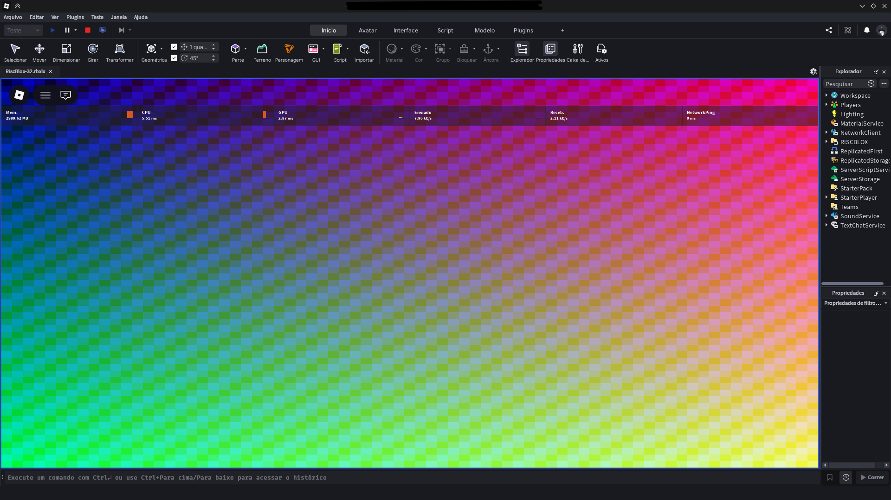
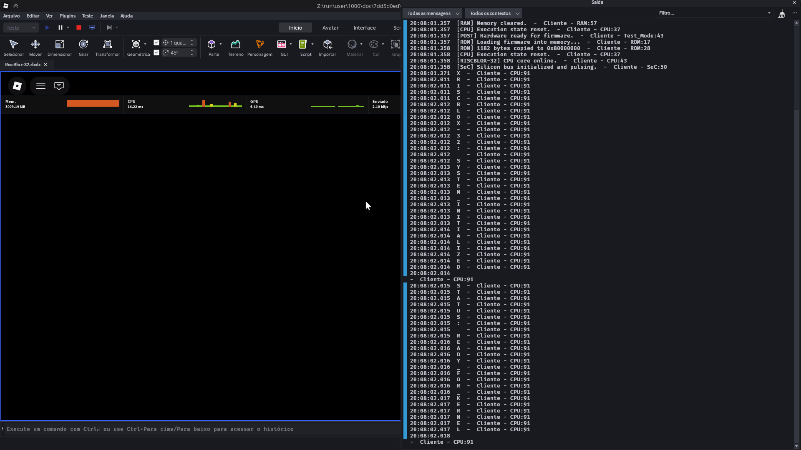
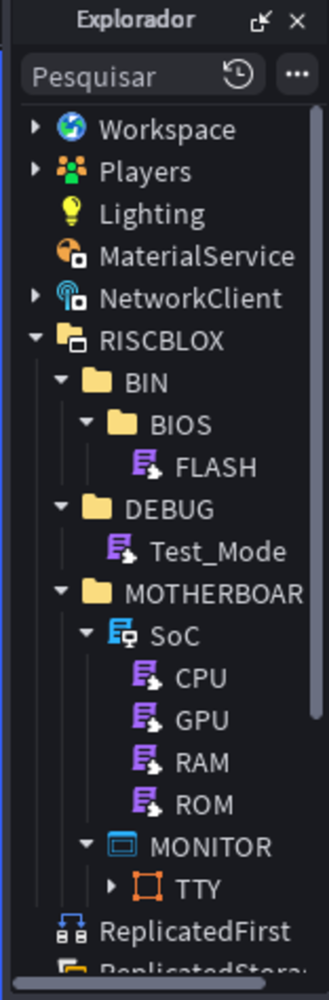

# RiscBlox-32

<p align="center">
  
</p>

<p align="center">
  A virtual RISC-V RV32I computer system implemented inside Roblox.
</p>

---

## Overview

RiscBlox-32 is an experimental virtual computer platform built inside the Roblox engine.

The project recreates a small hardware system using modular components, including a custom RV32I CPU emulator, RAM subsystem, framebuffer GPU, ROM firmware loader, and a hardware-inspired boot process.

The goal is to explore low-level computer architecture concepts such as:

* CPU instruction execution
* Memory addressing
* Firmware initialization
* Graphics pipelines
* Hardware abstraction
* System-on-chip design

RiscBlox-32 is designed as a virtual motherboard where each component behaves as an independent hardware module controlled by the SoC layer.

---

## Features

* Custom RV32I CPU emulator
* Modular motherboard architecture
* Virtual RAM with memory mapping
* Framebuffer-based GPU
* RGB565 graphics pipeline
* ROM firmware loading
* BIOS-style startup flow
* Hardware POST diagnostics
* TTY-oriented display architecture
* Open-source development under AGPL-3.0

---

## Architecture

The system is organized as a virtual hardware platform:

```
RISCBLOX
|
├── BIN
│   └── BIOS
│       └── Firmware tools
|
├── DEBUG
│   └── Hardware diagnostics
|
└── MOTHERBOARD
    |
    ├── SoC
    |   └── System integration layer
    |
    ├── CPU
    |   └── RV32I execution core
    |
    ├── GPU
    |   └── Framebuffer renderer
    |
    ├── RAM
    |   └── Unified memory subsystem
    |
    ├── ROM
    |   └── Firmware loader
    |
    └── MONITOR
        |
        └── TTY
            |
            └── PIXELS
```

Each component is separated into its own module, allowing the virtual machine to behave similarly to a physical computer system.

---

## Boot Process

RiscBlox-32 follows a hardware-inspired startup sequence:

1. SoC applies power to the virtual hardware
2. GPU initializes the display subsystem
3. POST performs diagnostics
4. RAM integrity is tested
5. GPU framebuffer test is executed
6. Hardware state is reset
7. Firmware is loaded from ROM
8. CPU begins execution

Example output:

```
[SoC] Firing boot voltage to RISCBLOX-32 System...
[POST] RAM ........ PASS
[POST] GPU ........ PASS
[POST] CPU ........ READY
[ROM] Loading firmware into memory...
[RISCBLOX-32] CPU core online.
```

---

## CPU

The CPU module implements a custom interpreter based on the RISC-V RV32I instruction architecture.

Implemented features include:

* 32 general-purpose registers
* Program counter handling
* Arithmetic and logical operations
* Load/store instructions
* Branch instructions
* Jump operations
* Basic machine-level control flow

Instructions are executed from the virtual memory space and communicate with peripherals through memory operations.

---

## GPU

The graphics subsystem uses a framebuffer-based rendering model.

Specifications:

* Logical resolution: **600×480**
* Physical display grid: **75×60**
* Pixel format: **RGB565**
* Dedicated VRAM region
* Dirty-block rendering optimization

Framebuffer data is converted into Roblox GUI elements, allowing the virtual machine to display graphical output.

---

## Memory System

The RAM subsystem provides a simulated physical memory layer.

Features:

* Address-based memory access
* 8-bit, 16-bit, and 32-bit operations
* Dedicated VRAM area
* Memory initialization and clearing
* Shared communication layer between hardware components

The memory model allows the CPU, GPU, and firmware to interact through a common address space.

---

## Screenshots

### Display Output


### Hardware Diagnostics



### Project Structure



---

## Project Structure

```
bios/
    Low-level firmware build environment

RISCBLOX/
    Virtual hardware modules

docs/
    Documentation and screenshots

RiscBlox-32.rbxlx
    Roblox Studio project file
```

---

## Running

1. Clone this repository.
2. Open `RiscBlox-32.rbxlx` with Roblox Studio.
3. Start Play/Test mode.
4. Observe the virtual hardware boot sequence.

---

## Current Status & Lifecycle

RiscBlox-32 is a **concluded experimental project** and serves as a complete Proof of Concept (PoC) for low-level architectural emulation. All core modules are finalized and working together.

> 🛑 **Notice:** This project is now in an immutable, feature-complete state. It is provided **as-is**. There are no plans to add new features, expand instruction coverage, or maintain the codebase. Forking is highly encouraged if you wish to experiment with it.

### Implemented Modules:

* ✅ **RV32I CPU Emulator:** Full interpretation core with 32 registers and sign extension.
* ✅ **RAM Subsystem:** Address-based unified memory with 8/16/32-bit operations.
* ✅ **GPU Framebuffer Renderer:** RGB565 pipeline with dirty-block optimization.
* ✅ **ROM Firmware Loader:** Handles BIOS injection directly into the SoC layer.
* ✅ **Hardware Diagnostics (POST):** Automated RAM and GPU integrity checks on boot.

---

## Firmware Compilation

If you want to modify the BIOS or use the build tree as a starting point for your own firmware, the environment is ready.

### Toolchain Prerequisites

You need a RISC-V GNU toolchain installed on your host system (e.g., `riscv64-elf-gcc`).

### Building

Navigate to the `bios/` directory and run `make`:

```bash
cd bios
make
```

---

## License

RiscBlox-32 is licensed under the GNU Affero General Public License v3.0.

See `LICENSE` for details.

---

## Author

Created by **v1ruzzz1_0**

Copyright © 2026 v1ruzzz1_0
